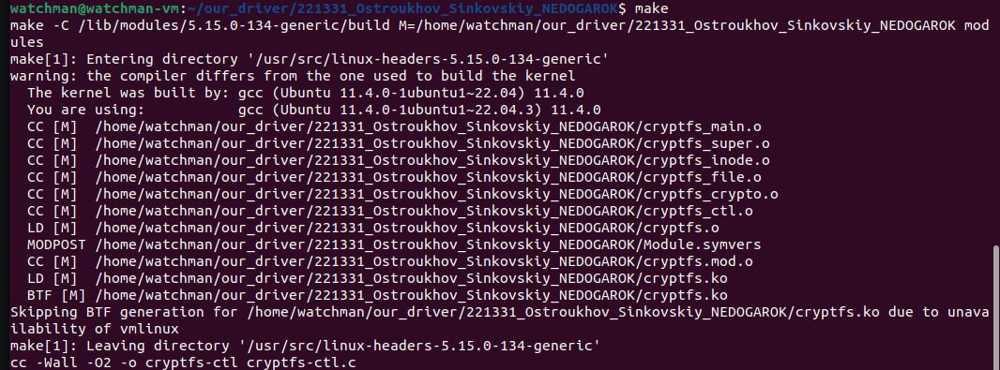
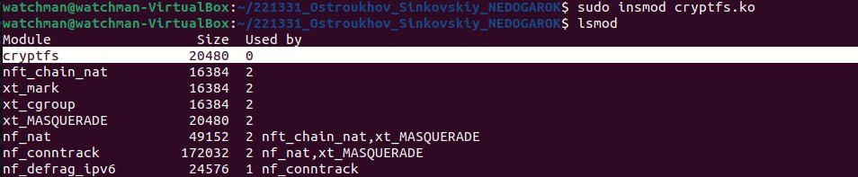
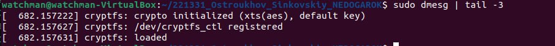
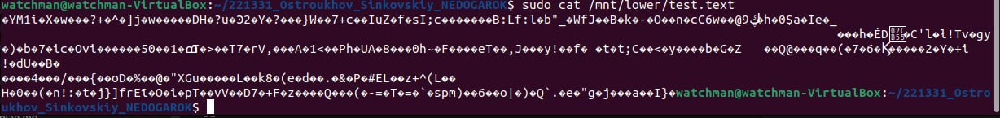
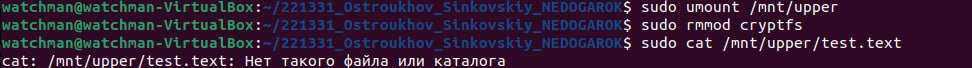
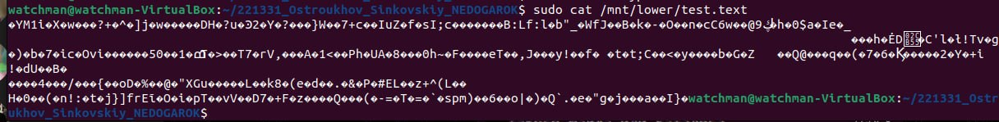

# cryptfs — Stackable FS with transparent AES-256-XTS encryption

Реализация stackable-файловой системы по плану из `cryptfs_plan.md`.

> **Целевое ядро — Linux 5.15 LTS** (Ubuntu 22.04). Код опирается на
> API этого ядра: `fs_context` + `get_tree_nodev`, в inode_operations —
> `struct user_namespace *mnt_userns` (параметр `&init_user_ns`),
> `generic_fillattr(userns, inode, stat)` без `request_mask`,
> поля времени inode читаются/пишутся прямым доступом к
> `inode->i_[acm]time`.

## Сборка

```bash
make
```


Используется системный `gcc` (на Ubuntu 22.04 это gcc-11, которым
собрано и само ядро 5.15 — версии компилятора совпадают, никаких
обёрток не требуется).

После сборки на диске:
- `cryptfs.ko` — kernel-модуль
- `cryptfs-ctl` — userspace-утилита для управления ключом

## Загрузка

```bash
sudo insmod cryptfs.ko
dmesg | tail
# ожидается:
#   cryptfs: crypto initialized (xts(aes), default key)
#   cryptfs: /dev/cryptfs_ctl registered
#   cryptfs: loaded
```

Появляется:
- зарегистрированная ФС `cryptfs` в `/proc/filesystems`
- управляющее устройство `/dev/cryptfs_ctl`

Проверка того, что модуль ядра загружен и работает в фоновом режиме




## Монтирование

```bash
sudo mkdir -p /mnt/lower /mnt/upper
sudo mount -t cryptfs -o lowerdir=/mnt/lower none /mnt/upper
```

Все чтения/записи через `/mnt/upper/...` прозрачно шифруются
AES-256-XTS. Шифртекст хранится в `/mnt/lower/`.

## Смена ключа

Модуль стартует с тестового «нулевого» ключа. В реальной работе:

```bash
KEY=$(./cryptfs-ctl genkey)
sudo ./cryptfs-ctl setkey "$KEY"
```

> **Важно:** ключ — глобальный для всех mount-точек cryptfs. Менять
> ключ в момент активных I/O не следует.

## Проверка
По умолчанию модуль ядра шифрует только файлы ".text", это можно изменить в файле "cryptfs_file.c".
```bash
echo "hello, cryptfs" | sudo tee /mnt/upper/test.text
sudo cat /mnt/upper/test.text            # => "hello, cryptfs\n" + нули до 512 байт
sudo xxd /mnt/lower/test.text | head     # => случайно выглядящий шифртекст
```



## Размонтирование и выгрузка

```bash
sudo umount /mnt/upper
sudo rmmod cryptfs
```


При этом /mnt/lower сохраняет файлы в прежнем виде после повторного монтажа



## Структура исходников

| Файл                | Назначение                                       |
|---------------------|--------------------------------------------------|
| `cryptfs_main.c`    | module init/exit, регистрация `file_system_type` |
| `cryptfs_super.c`   | `fs_context`, разбор опций, `fill_super`, sops   |
| `cryptfs_inode.c`   | upper-inode lifecycle + `inode_operations`       |
| `cryptfs_file.c`    | `read_iter` / `write_iter` с шифрованием         |
| `cryptfs_crypto.c`  | обёртка над kernel crypto API (`xts(aes)`)       |
| `cryptfs_ctl.c`     | `/dev/cryptfs_ctl` — ioctl для ключа             |
| `cryptfs-ctl.c`     | userspace-утилита                                |
| `cryptfs.h`         | внутренний заголовок модуля                      |
| `cryptfs_uapi.h`    | общий заголовок userspace/kernel (ioctl)         |
                                          
                                                                                
Что делать, если insmod упадёт                                                
                                                                                
  - Invalid module format / version magic — почти всегда uname -r не совпадает с
   версией, под которую собрали. make clean && make после sudo apt install 
  linux-headers-$(uname -r).                                                    
  - Любой kernel panic/oops — изучение логов dmesg 
                                                                                
